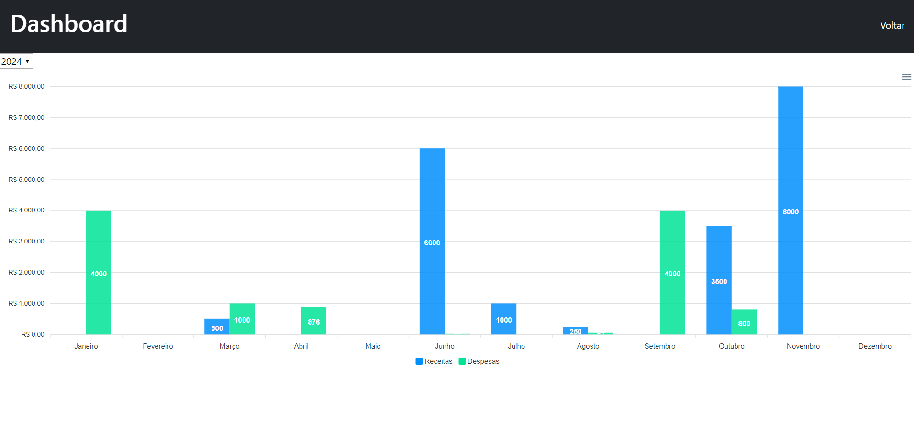

# GestaoPessoal

Bem-vindo ao projeto de Finanças, um site de gestão financeira desenvolvido com HTML, CSS, JavaScript e Node.js, com integração ao banco de dados não relacional MongoDB. Este projeto foi criado com o objetivo de fornecer uma ferramenta simples e eficaz para o gerenciamento de finanças pessoais. Com ele, você pode acompanhar suas despesas, receitas, cartões e ainda visualizar gráficos comparativos para uma melhor compreensão de sua situação financeira.

 ## Funcionalidades Principais
- **Cadastro de Cartões**: Adicione informações detalhadas sobre seus cartões de crédito ou débito, como número, data de vencimento e limite de crédito.

- **Cadastro de Receitas**: Registre suas fontes de renda, como salários, recebimentos diversos e investimentos.

- **Cadastro de Despesas**: Insira informações sobre suas despesas, categorizando-as e especificando os valores gastos em diferentes áreas.

- **Gráficos Comparativos**: Visualize gráficos que permitem comparar suas receitas e despesas ao longo do tempo, normalmente organizados por mês.

- **Integração com MongoDB**: Utilizamos o MongoDB como banco de dados não relacional para armazenar e recuperar suas informações financeiras de maneira eficiente.

## Problema Principal 
Muitas pessoas enfrentam dificuldades para acompanhar suas finanças e tomar decisões informadas devido à falta de ferramentas simples e eficazes para gerenciar suas receitas, despesas e cartões de crédito.

## Solução Proposta 
O projeto "Finanças" oferece uma solução completa para essa problemática, permitindo que os usuários registrem suas finanças de forma organizada e visualizem gráficos informativos para uma melhor compreensão de suas finanças pessoais.

## Tela de Login 
- Tela simples de login.
- Login : Usuário e Senha.

## Tela de Cadastro
- Tela de cadastro com imagem.
- Cadastro: Imagem, Nome, Email, Telefone, Endereço e Senha.

## Tela principal 
- Home page.
- Resumo de finanças, cartões, transações e investimentos.

## Tela Dashboard
- Dashboard dinâmico e interativo.
- Possivel ver as despesas e receitas de cada ano ou filtrar informações para melhor visualização dos dados.

## Tela Receitas
- Cadastro das receitas.
- Data, Descrição e Valor.
- Lista ordenada pela data para melhor visualização.

## Tela Transações
- Cadastro das transações.
- Data, Descrição, Forma de pagamento (Se cartão,abre uma nova opção para selecionar qual cartão), Valor e categoria.
- Lista ordenada pela data para melhor visualização.

## Tela Categorias
- Visualização por categoria das despesas.
- Seleção de categoria para mais detalhes das despesas da mesma.

## Tela Cartões
- Cadastro de cartões.
- Bandeira, Número, Nome no cartão, Validade, Código de segurança, Limite e Apelido.
- Visualização dos cartões cadastrados.

## Tela Perfil
- Visualização do perfil logado.
- Edição do mesmo.
- Deslogar.

